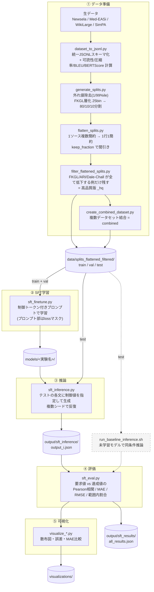
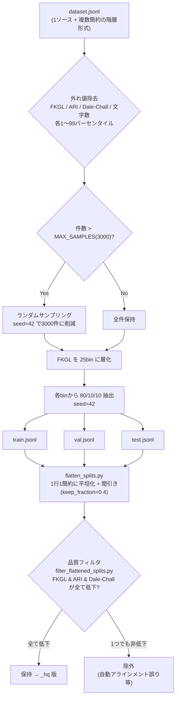
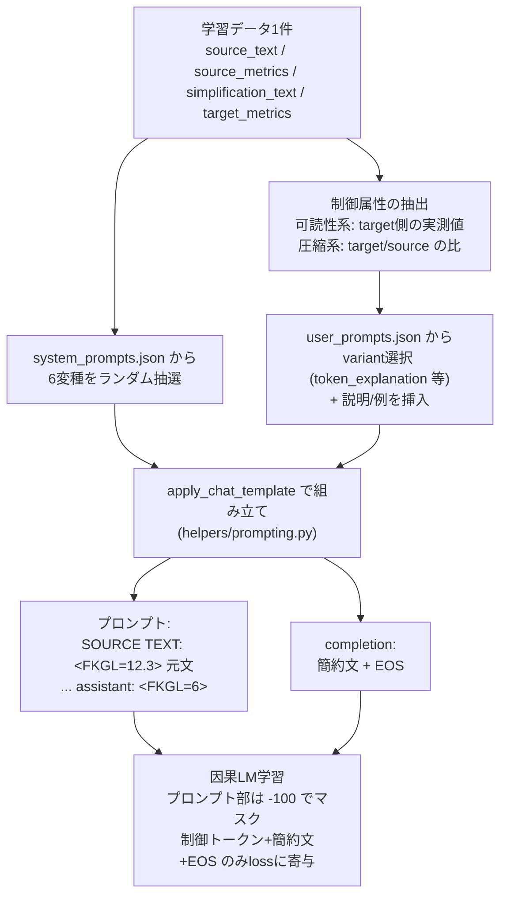
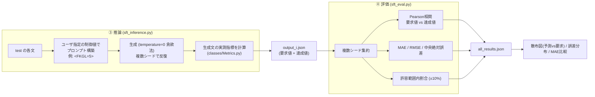
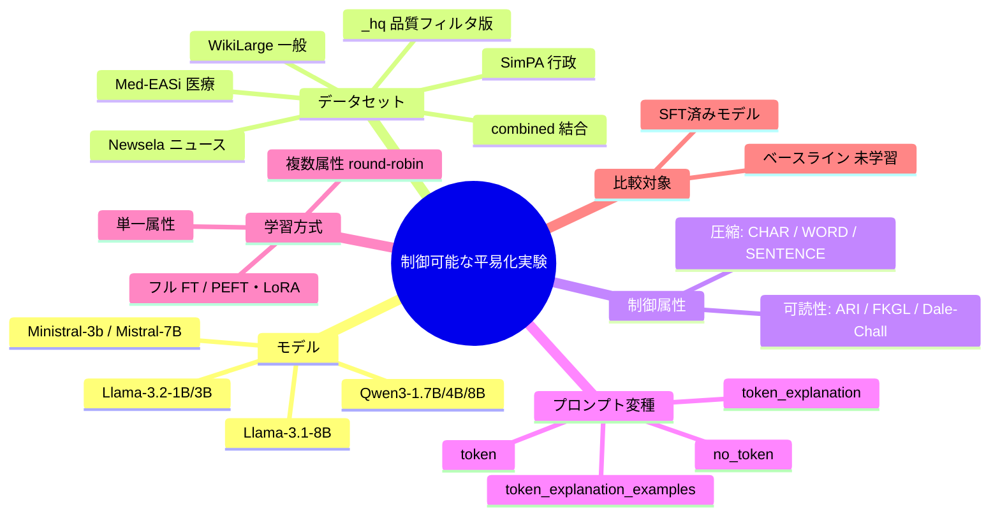

# 実験フロー全体図（データ分割 → 評価）

この実験の目的は、**制御トークン (`<FKGL=6>` など) を付けて LLM を SFT し、
数値で平易化の目標（可読性レベル・圧縮率）を指定して生成を制御できるか**を検証することにある。
ここでは、データ分割から評価までの流れを mermaid 図で整理する。

---

## 1. 全体パイプライン

---

## 2. データ分割の詳細（① の内部）

> WikiLarge の `splitwise`/`global`/`ori` は原 split を保持していない（約2,000件に間引き済みのサブセットから新規分割）。
> 詳細は `taming-CATS/documents/wikilarge_processing_history.md` を参照。

---

## 3. 学習インスタンスの組み立て（② の内部）

制御可能性の核心。プロンプトに制御トークンを埋め込み、**目標値（=簡約文の実測値）を当てるように学習**する。

- **単一属性学習** (`sft_finetune.py`): 1モデル = 1 metric。
- **複数属性学習** (`sft_finetune_all_ctrl_attr.py`): metric をラウンドロビンで混在させ 1モデルで複数制御。

---

## 4. 推論 → 評価の流れ（③④ の内部）

**評価の問い**＝「ユーザが要求した制御値 (`<FKGL=5>`) に対し、生成文の実測 FKGL がどれだけ一致するか」。
相関が高く誤差が小さいほど、制御トークンによる平易化制御が効いていることを示す。

---

## 5. 実験で振るパラメータ（比較軸）

各軸を「どのスクリプト・どの設定で変えるか」は [reproduction_guide.md](reproduction_guide.md)、
ディレクトリ・ファイルの役割は [directory_roles.md](directory_roles.md) を参照。
